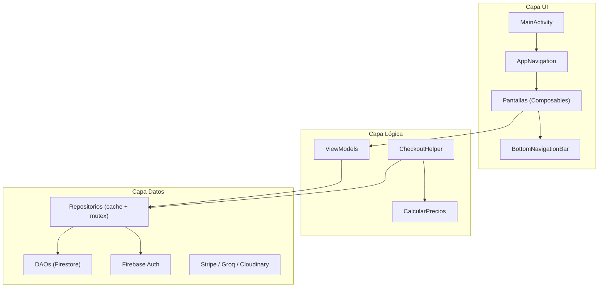

# Pronto  
  
Pronto es una aplicación móvil para Android que mejora la experiencia de compra en supermercados y tiendas físicas. Permite escanear productos en tiempo real, gestionar un carrito digital con precios y descuentos actualizados automáticamente, y organizar listas de la compra compartidas entre usuarios.  
  
La idea surge de la necesidad de optimizar el proceso de compra, reducir tiempos, evitar olvidos y ofrecer una experiencia más organizada y eficiente, ya que muchos supermercados cuentan con sus propias aplicaciones, pero a todos ellos les faltan herramientas que facilitarían la vida de sus clientes.  


---  
  
## Funcionalidades principales  
  
### Escáner de códigos de barras  
- Escaneo en tiempo real mediante la cámara del dispositivo (CameraX + ML Kit).  
- Soporte para códigos EAN-13 estándar y códigos especiales de productos al peso (prefijo `23`).  
- Modo automático: escanea y añade al carrito sin intervención adicional.  
- Opción de ver el detalle del producto o añadirlo manualmente al carrito.  

  
### Carrito digital  
- Visualización de productos añadidos con precios, cantidades y descuentos aplicados.  
- Cálculo automático del total con ofertas vigentes y cupones canjeados.  
- Pago integrado mediante Stripe, sin necesidad de pasar por caja.  
- Generación automática de ticket tras completar el pago.  


  
### Motor de precios y descuentos  
- Soporte para múltiples tipos de descuento:  
  - **Segunda unidad** (ej. 50% en la 2ª unidad, combinable entre productos).  
  - **NxM** (ej. 3x2, 4x3).  
  - **Cupones**: fijos, porcentuales y de precio máximo, con mínimo de compra configurable.  
- Validación de vigencia de ofertas por fecha.  

  
### Listas de la compra compartidas  
- Creación de múltiples listas con posibilidad de invitar a otros usuarios por email.  
- Sistema de invitaciones con aceptación/rechazo.  
- Visualización en tiempo real de qué productos ya están en el carrito y cuáles no.  
- Ordenación por fecha de añadido, nombre, precio o categoría.  
- Sugerencias inteligentes:  
  - **Productos frecuentes** basados en el historial de compras.  
  - **Alternativas a productos agotados** de la misma subcategoría.  

  
### Catálogo de productos  
- Búsqueda y filtrado por categorías y subcategorías.  
- Ficha de producto con descripción, imagen, precio, alérgenos, IVA y stock.  
- Soporte para productos por unidad y por peso.  


### Asistente Pronto (Chatbot IA)  
- Chatbot integrado con la API de Groq (LLM).  
- Sugerencias de productos, consultas sobre ofertas y ayuda general durante la compra.  
  
### Cupones  
- Pantalla dedicada para visualizar y canjear cupones disponibles.  
- Aplicación automática de cupones al total del carrito en el checkout.  

  
### Historial de compras  
- Acceso a tickets de compras anteriores con desglose de productos, descuentos aplicados y total.  


  
### Perfil de usuario  
- Gestión de cuenta con Firebase Auth.  
- Subida de imagen de perfil mediante Cloudinary.  
- Selección de tema: claro, oscuro o según el sistema.  


---  
  
## Stack tecnológico  
  
| Capa | Tecnología |  
|---|---|  
| **UI** | Jetpack Compose, Material 3 |  
| **Navegación** | Navigation Compose (Single Activity) |  
| **Backend / BDD** | Firebase Firestore, Firebase Auth, Firebase Analytics |  
| **Pagos** | Stripe Android SDK |  
| **IA** | Groq Cloud API (LLM) |  
| **Escáner** | CameraX + Google ML Kit (Barcode Scanning) |  
| **Imágenes** | Cloudinary (subida), Coil (carga) |  
| **Red** | Retrofit, OkHttp, Volley |  
| **Persistencia local** | SharedPreferences |  
| **Concurrencia** | Kotlin Coroutines + Flow |  
| **Testing** | JUnit, MockK, Coroutines Test |  
  
---  
  
## Arquitectura  
  
Pronto sigue una **arquitectura Single Activity** con navegación declarativa mediante `NavHost`. La estructura del código se organiza en las siguientes capas:

app/src/main/java/com/example/persistencia/
├── Firestore/ # DAOs de acceso a Firebase Firestore
├── Herramientas/ # ViewModels, repositorios, utilidades y servicios
├── Modelos/ # Data classes (Producto, Descuento, Ticket, etc.)
├── Navegacion/ # Rutas, NavHost y barra de navegación inferior
├── Pantallas/ # Composables de cada pantalla
├── ui/ # Tema y estilos
├── Aplicacion.kt # Clase Application
└── MainActivity.kt # Entry point


### Patrón Repository con caché  
  
Los repositorios (`ProductosRepository`, `CarritoRepository`, `ListasRepository`, `TicketsRepository`, etc.) implementan un patrón singleton con caché en memoria protegida por `Mutex`, invalidándose tras cada operación de escritura.  
  
---  
  
## Pantallas  
  
| Pantalla | Descripción |  
|---|---|  
| `Inicio` | Login con Firebase Auth |  
| `Registro` | Registro de nuevo usuario |  
| `PantallaPrincipal` | Dashboard con accesos directos a escáner, lista, catálogo y chatbot |  
| `Catalogo` | Grid de productos con búsqueda y filtros por categoría |  
| `PantallaProducto` | Detalle de producto (precio, descripción, alérgenos, selector de cantidad) |  
| `Carrito` | Carrito de compra con descuentos aplicados y pago con Stripe |  
| `ListaCompra` | Listas compartidas con búsqueda, sugerencias e invitaciones |  
| `BarcodeScannerScreen` | Escáner de códigos de barras con modo automático |  
| `Perfil` | Perfil de usuario, tema y configuración |  
| `Cupones` | Cupones disponibles y canjeados |  
| `Chatbot` | Asistente IA (Groq) |  
| `TicketDetalle` | Detalle de un ticket de compra anterior |  
| `InvitacionesScreen` | Invitaciones pendientes a listas compartidas |  
  
---  
  
## Configuración del proyecto  
  
### Requisitos previos  
  
- Android Studio (Ladybug o superior recomendado)  
- JDK 11+  
- SDK mínimo: API 24 (Android 7.0)  
- SDK objetivo: API 36  
  
### Variables de entorno  
  
Crear o editar el archivo `local.properties` en la raíz del proyecto con las siguientes claves:  
  
```properties  
GROQ_API_KEY=tu_api_key_de_groq  
STRIPE_PUBLISHABLE_KEY=tu_publishable_key_de_stripe  
CLOUDINARY_CLOUD_NAME=tu_cloud_name  
CLOUDINARY_UPLOAD_PRESET=tu_upload_preset
```

### Firebase  
  
Añadir el archivo `google-services.json` en `app/` con la configuración de tu proyecto Firebase (Firestore, Auth y Analytics habilitados).  
  
### Build  
  
```bash  
./gradlew assembleDebug
```

---  
  
## Tests  
  
El proyecto incluye tests unitarios para la lógica de negocio:  
  
```bash  
./gradlew test
```

| Test | Cobertura |  
|---|---|  
| `CalcularPreciosTest` | Cálculo de segunda unidad, NxM, precios unitarios y totales de grupo |  
| `TotalCarritoTest` | Total del carrito con ofertas y cupones combinados |  
| `CalcularTicketTest` | Generación de ticket con desglose de descuentos |  
| `DescuentosTest` | Vigencia y validación de descuentos |  
| `ModelosTest` | Validación de data classes |  
| `ChatViewModelTest` | Lógica del ViewModel del chatbot |  
  
---  
  
## Licencia  
  
Este proyecto no incluye una licencia explícita. Todos los derechos reservados.
